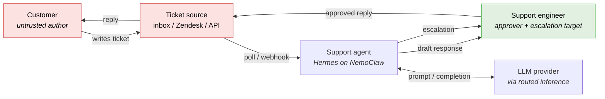
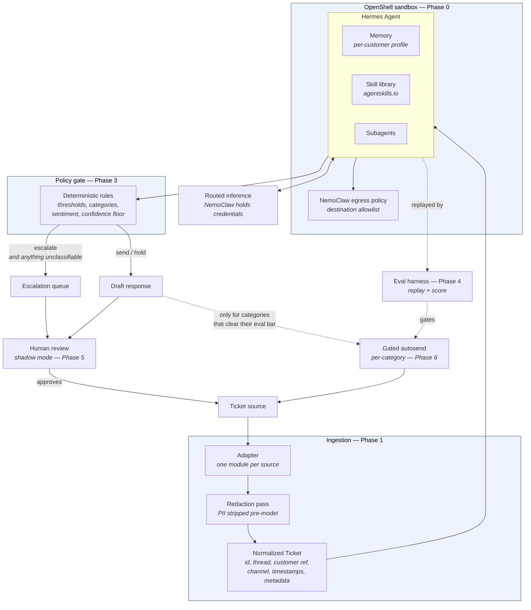
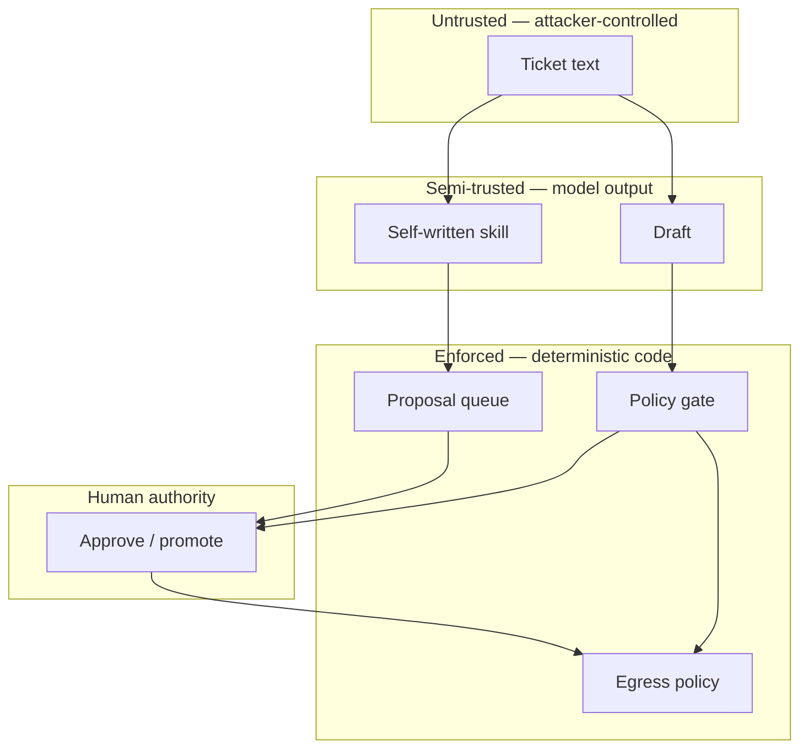
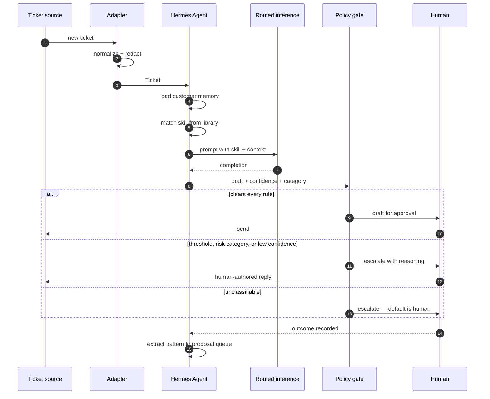
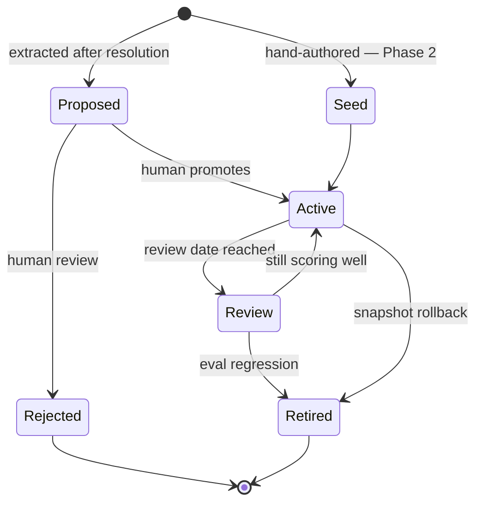
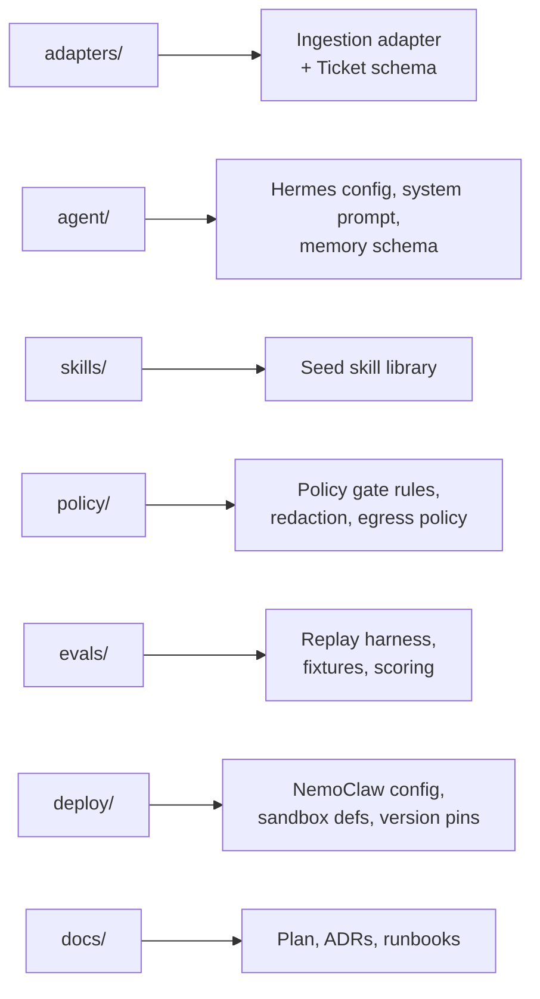
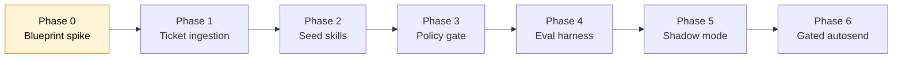

# Architecture

Diagrams for the support agent described in [`README.md`](../README.md), built on Hermes Agent
under the NVIDIA NemoClaw blueprint ([ADR 0001](adr/0001-runtime-nemoclaw-hermes.md)) and
delivered in phases ([PLAN](PLAN.md)).

This document is the target architecture, not a description of what is built today. Components
are annotated with the phase that introduces them.

**What exists now:** the [inbox agent](INBOX_AGENT.md) implements the ingestion adapter,
redaction pass, classifier, policy gate, and eval harness against a personal mailbox rather
than a ticket source — the same boxes below, wired to data that exists. It runs outside the
NemoClaw sandbox by design (read-only credentials, no outbound send path); see that document
for when the sandbox starts earning its cost.

## 1. System context

Who talks to the system, and across which boundary.

Ticket text is attacker-controlled input. Everything downstream of `source` treats it as data,
never as instructions — the reason the enforcement boundary sits below the agent rather than
inside its prompt.

## 2. Component architecture

The four boundaries from [PLAN](PLAN.md#architecture), expanded.

Read the dotted edges as "not on the request path": autosend is earned per category, and the
eval harness is what earns it.

## 3. Trust boundaries

Two independent controls stand between untrusted input and any outbound effect:

| Layer | Mechanism | Fails how |
|---|---|---|
| Policy gate | Deterministic code — thresholds, category triggers, confidence floor | A gate bug can misroute a ticket |
| Egress policy | NemoClaw network allowlist, below the agent | A bypassed gate still cannot reach an unapproved destination |

The gate is the control; the egress policy is what makes it survivable when the gate is wrong.
Prompt-level instructions are treated as UX, not as controls.

## 4. Ticket lifecycle

The final step never writes to the live skill library — extraction produces a *proposal*. That
path is [section 5](#5-skill-lifecycle).

## 5. Skill lifecycle

The README's premise is that the agent extracts its own patterns. That premise is also the
thing most likely to compound badly, so promotion is a human action with a hand-authored
baseline to make degradation visible.

Every skill carries provenance and a review date. There is deliberately no auto-promotion edge
in this diagram.

## 6. Repository layout

How the [target layout](PLAN.md#repository-layout-target) maps onto the components above.

## 7. Build order

Phase dependencies. Each phase has an exit criterion in [PLAN](PLAN.md#phases); do not start a
phase until its predecessor's criterion is met.

Phase 0 is the current phase; it is blocked on the five open questions in
[ADR 0001](adr/0001-runtime-nemoclaw-hermes.md#open-questions), which need confirmation against
NVIDIA's primary documentation.

## Unresolved

These leave shapes in the diagrams above that are not yet fixed:

- **Ticket source** — determines the adapter, threading model, and rate limits. Blocks Phase 1.
- **Model and hosting** — constrained by what NemoClaw's routed inference supports and by its
  hardware prerequisites.
- **Egress policy granularity** — whether per-destination policy with operator approval is
  expressible at the granularity section 3 assumes.
- **Gateway networking** — how Hermes' inbound messaging connections interact with sandbox
  network policy.
- **Retention** — how long per-customer memory persists, and the deletion path on an erasure
  request.
